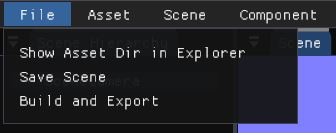

# Moving Object Tutorial

This is a tutorial that will cover how to set up a moving and scaling object
using Lua scripting

## Open existing project

Open the project in the [`examples\moving_object_tutorial`](../../examples/moving_object_tutorial) directory. You may download the project as zip via GitHub, or clone the repository for the project.


## Create new empty sprite entity 

Now, we need to make an entity that has the sprite component, we can easily do this by using the menu button at the top. Go to `Scene > New Empty Sprite` and it will create an entity with the `position` and
`sprite` component.


## Import sprite

For now, narechi only supports `.png` image files. In this guide, make sure you
have prepared one to use. Copy or move the image into the assets directory for
the engine to be able to reference it.

You can use the menu bar directory `File > Show Asset Dir in Explorer` to help
you open the asset directory with ease.

Now, let's open up the sprite import panel by going to the menu bar directory
`Asset > Import Sprite` which will open the panel up.


Now, we click on the "Dir" button to help us easily
input the image directory. Select the image using
the (Windows) file explorer and press "Open" in the file
explorer.


Now that the directory should be set in the "Image directory"
field, press the "Import" button to proceed on and
create a meta file for the image for the engine to
reference in the `sprite` component. The panel
should close when imported.

Now, let's select the new sprite entity `New Sprite` in the hierarchy and go to
the inspector and press the "Select" button on the
right of the sprite component. Select the new meta file with
extension `.nrcsprite` in the explorer and press "Open".


Our sprite should now be in the scene!


## Adjustments

Now, our sprite is a little bit too small, so let us adjust
the size appropriately by adding the scale component.

We can add this component by going to the menu bar and going
to the directory `Component > Add Scale`.


This will add the
scale component on the entity as can be shown in the inspector.


Let's change the scale values to fit our sprite (this will depend
on the sprite that you are using, of course).


Let's save the scene so we don't lose progress.



## Scripting

Now, let's move on to scripting. Let us create a lua file in a subfolder called
`scripts` (create this subfolder first). You may name it anything,
but for this tutorial, we will name it `main.lua`.


Let's write some lua code into the file, and save it.

```lua
function update_move_to_pos(narechi__scene__component__position, narechi__scene__component__scale)
    local position = narechi__scene__component__position
    position:set_depth(2)

    position:set_vec2(vec2(10, 10))
end
```

### API Explanation

To basically explain the Lua API:

* Each function is an ECS query that will be called on update
* The function name is the query's name, it won't matter as much
* The parameters of the function is the query
* In-built components of the engine will have to be prepended with `narechi__scene__component__`
* Components are typeless, hence, there is a need for an accessor, hence, the `set_depth` function which enables the
`set_vec2` function
* Queries that will be called every frame should be prepended with `update`,
and those that are called when the program begins should preprended with `init`

To explain the depth system, each component is broken down into a
serializable struct like `{ x: 32 }`. Hence, if we want to access
this float `x`, depth needs to be 1 as we traverse into the first
set of braces. For in-built components like `narechi::scene::component::position`, they have two layers, so they are serialized as `{ { x: ..., y: ... }}`. Hence, it requires a `set_depth(2)` before accessing using anything.

### Activate new script

Now, go back to the editor, and compile the lua scripts by
going to the menu bar item in the directory `Asset > Recompile Scripts`.


If done, correctly, multiple things will happen:

* Lua meta file is created in the `assets/scripts` directory
* The sprite entity will move to position `{x: 10, y: 10}`


### Dynamic movement

Now, let's move on to add some dynamic movement into the script.

Let's add an accumulator at the top of the lua file.

```lua
accumulator = 0.0
```

Now, let's go back into the function and let the value accumulate (you may freely change this value `(0.01)` to whatever you'd like)

```lua
function ...
    accumulator = accumulator + 0.01
end
```

Now, let's use this in a mathematical function so we can have
some back and forth movement.

```lua
    position:set_vec2(vec2(math.sin(accumulator), 0.0))
```

The end script should look something like this:
```lua
accumulator = 0.0

function update_move_to_pos(narechi__scene__component__position, narechi__scene__component__scale)
    local position = narechi__scene__component__position
    position:set_depth(2)

    accumulator = accumulator + 0.01
    position:set_vec2(vec2(math.sin(accumulator), 0))
end
```

Recompile the script using the same menu bar item, and if done correctly, the entity will be moving back and forth.


### Extra

We can perform the same thing with scale. Let us just add another
accessor for scale first:

```lua
    local scale = narechi__scene__component__scale
    scale:set_depth(2)
```

Let's store the original scale that we were using in the inspector:

```lua
    local original_scale = vec2(10, 12)
```

Then, let's adjust the scale by a mathematical function as well as
linking it to the accumulating value.

```lua
    local new_scale = original_scale * math.cos(accumulator)
```

Finally, let's set the scale's value to our new scale.

```lua
    scale:set_vec2(new_scale)
```

The final script should look like this:

```lua
accumulator = 0.0;

function update_move_to_pos(narechi__scene__component__position, narechi__scene__component__scale)
    local position = narechi__scene__component__position
    position:set_depth(2)

    local scale = narechi__scene__component__scale
    scale:set_depth(2)

    local original_scale = vec2(10, 12)
    local new_scale = original_scale * math.cos(accumulator)

    accumulator = accumulator + 0.01
    position:set_vec2(vec2(math.sin(accumulator), 0))
    scale:set_vec2(new_scale)
end
```

Recompile the script and this should be the result with
your sprite:


