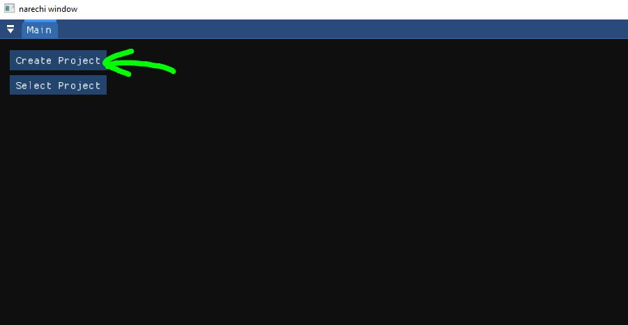
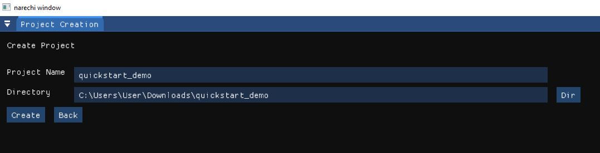
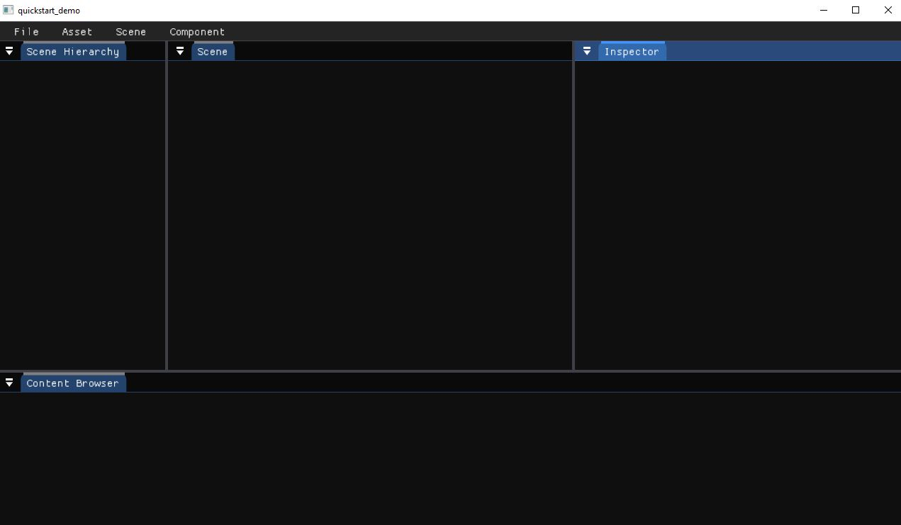
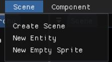
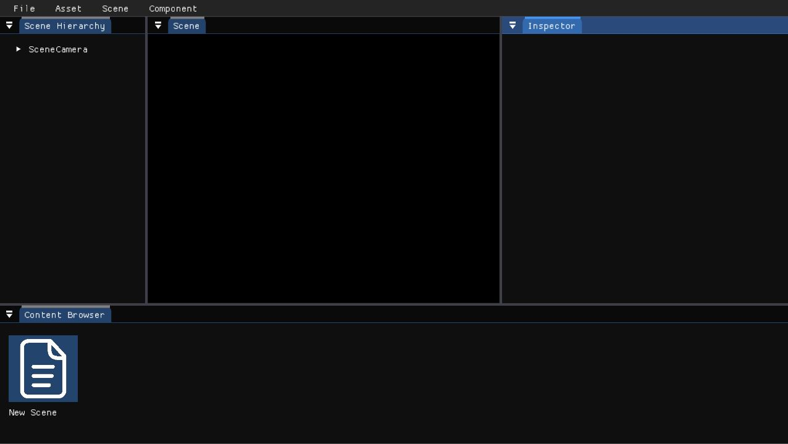
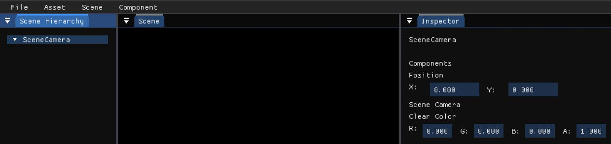
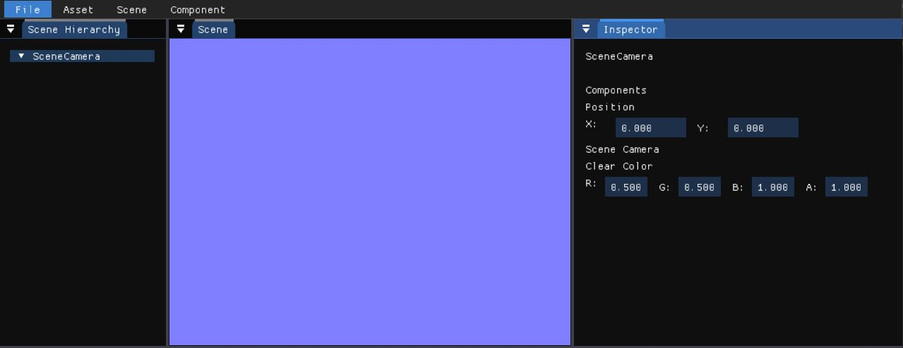
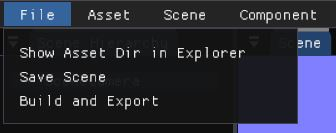

# Quickstart

This is a guide on how to create a project using the narechi editor for the
first time.

## Create new project

Start the editor executable in the folder downloaded from the releases. Move to
the project creation panel by clicking the "Create Project" button.

Fill in the blank fields in the project creation panel. You may fill in the
directory field by using the "Dir" button which will open up a select folder
window.

Click the "Create" button once we are finished with filling up the blanks.

We will now enter the editor, the window should now look like this:

## Create the scene

Now, let us create a scene by using the menu at the top and clicking this directory: `Scene > Create Scene`

Three things will happen:

* There will now be an empty black background in the scene panel
* New Scene asset will be created in the Content Browser panel which
* Default scene camera will be added to the scene, as can be
seen in the hierarchy

Which can be seen as follows:

## Adjust the scene

Let's make some changes to the scene. Click on the `SceneCamera` object in the
scene hierarchy panel. Its components will appear in the
 inspector panel on the right.

Let's change the color of the background by changing
the clear color. Let's change it to something nice like
a light blue color like `R: 0.5, G: 0.5, B: 1.0, A: 1.0`.

We may save the scene by going to the menu and clicking on
this directory: `File > Save Scene`

